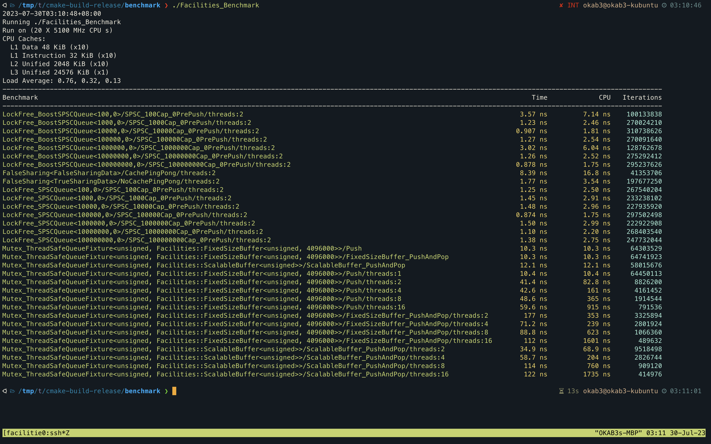

## SPSC Queue 介绍

首先介绍一下什么是 *SPSC*，*SPSC* 的全称是 *Single Producer Single Consumer*，是一种生产者消费者模型下的特殊情况：只有一个生产者以及一个消费者。

## SPSC Queue 使用场景

使用 *SPSC Queue* 的场景主要是在两个线程间进行消息通讯，常见于程序的线程模型定义清晰的情况。
例如在一个典型的网络程序中，往往会有一个独立的网络线程以及若干个处理线程，网络线程在收到数据后将其转发至其中一个处理线程中。这里存在两种通信方式：

* 网络线程与处理线程可以通过一个单生产者多消费者队列来进行数据通信，
* 网络线程也可以通过与每一个处理线程建立独立的 *SPSC Queue* 来进行数据通信。

在吞吐量巨大的系统中，使用 *SPSC Queue* 的性能将更加优秀，因为 *SPSC Queue* 可以实现 *LockFree*  的 *Wait Free* 控制级别，并发能力极强。

## Mutex 的缺陷

[[Linux Mutex 实现原理]]，介绍了 *Mutex* 的底层实现原理以及配套的性能优化思路。但是无论如何优化，*Mutex* 都有一个无法绕过去的问题：

1. 对于同一个数据结构每次只有一个线程可以访问
2. 并发竞争时需要通过 *syscall* 陷入内核态通过操作系统来裁决

执行 *syscall*  时，操作系统需要做许多的工作，除了必要的权限检查等等以外，内核还需要切换 CPU 的寄存器。这将导致一个隐形的问题，它将破坏 CPU 的 *L1* 、*L2*、*L3 Cache*，由此造成的 *Cache Missing* 开销是巨大的。

## LockFree 技术

*LockFree* 技术有其独特的技术优势，但同样它也有自己的劣势。

**优势：**

* 相比常见的基于 *Mutex* 的并发控制技术，存在数量级级别的性能优势
* 避免 *Mutex* 导致的各种死锁问题

**劣势：**

* 使用 *LockFree* 开发需要很高的技术
* 难以调试 Debug

:::warning
*LockFree* 并不是银弹，在使用 *LockFree* 技术前有一些注意事项：

1. 你已经 Benchmark/Profiling 了你的程序，发现其中的某些数据结构存在并发性能瓶颈
2. 优先尝试寻找时间复杂度更优秀的算法，再尝试考虑 *LockFree*
3. 当你使用 *LockFree* 技术重构了瓶颈模块后，再次 Benchmark/Profiling
:::

## 代码实现

这里参考了 *Boost::LockFree* 库中 *SPSC Queue*  的实现，首先介绍一下整体思路。

首先是 Buffer，为了避免内存分配导致的额外开销，*Boost::LockFree* 实现的 *SPSC Queue* 默认采用了 *Ring Buffer*，这需要在编译期确定 *Buffer Size* 大小。
其次，是 *Enqueue* 与 *Dequeue* 操作中需要 *Memory Order* 来保证多线程执行时的可见性。核心思路是需要保证数据被写入/清理后再更新 *Ring Buffer* 的 *Write/Read Index*，这样可以保证其他线程在观察到 *Index* 变化之后 *Ring Buffer* 中的数据已经被修改完毕。

下面是一份自行实现的玩具级别 *SPSC Queue Example*，与 *Boost::LockFree* 实现的 *SPSC Queue* 有不少的差异：

* *Boost::LockFree* 不仅支持 *RingBuffer* 还支持动态扩容
* *Boost::LockFree* 拥有更丰富的功能，例如支持批量 *Enqueue* 或 *Dequeue*
* 自行实现的版本只支持 *Trivial* 类型



上面的截图是使用 *Google Benchmark* 运行的结果：*LockFree_BoostSPSCQueue* 是 *Boost::LockFree* 实现的版本；*LockFree_SPSCQueue* 是自行实现的版本；最后的 *Mutex_ThreadSafeQueue* 是使用 *Mutex* + *Conditional Variable* 实现的队列，其中包含了 *RingBuffer* 与 *ScalableBuffer* 两种版本。

从 Benchmark 的结果可以看到，采用 *LockFree* 技术的性能明显优于 *Mutex* 的版本。且自行实现的 *SPSC Queue* 在性能上和 *Boost::LockFree* 属于同一梯队。

如果按照 2 ns 的时间来计算 OPS (Operation Per Seconds)，使用 *LockFree* 技术的 *SPSC Queue* 可以达到 5 亿的 OPS。与此同时，根据 *Mutex* 的版本在 2 Thread 模式下的 CPU 时间（取 50 ns），理论的 OPS 可以达到 2 KW，相比之下少了一个数量级。

### 完整的 *SPSC Queue* 实现

```cpp
//
// Created by Chen, WenTao on 2023/6/24.
//

#pragma once

#include <array>
#include <atomic>
#include <cstddef>
#include <limits>
#include <stdexcept>

namespace Facilities {

template <size_t Capacity>
concept QueueCapacityValid = requires() {
  requires(Capacity > 0);
  requires(Capacity != std::numeric_limits<size_t>::max());
};

template <typename T, size_t Capacity>
  requires QueueCapacityValid<Capacity>
class LockFreeSPSCQueue {
  inline static constexpr size_t kActualSize = Capacity + 1;
  inline static constexpr size_t kAlignSize = 64;

  using Index = size_t;
  using RingBuffer = std::array<T, kActualSize>;

 public:
  bool Push(T value) {
    auto head = head_.load(std::memory_order::acquire);
    auto tail = tail_.load(std::memory_order::relaxed);

    if (IsFull(head, tail)) {
      return false;
    }

    ring_buffer_[tail] = value;
    tail_.store(NextIndex(tail), std::memory_order::release);
    return true;
  }

  bool Pop() {
    auto head = head_.load(std::memory_order::relaxed);
    auto tail = tail_.load(std::memory_order::acquire);

    if (IsEmpty(head, tail)) {
      return false;
    }

    head_.store(NextIndex(head), std::memory_order::release);
    return true;
  }

  T Front() const {
    size_t index = head_.load(std::memory_order::acquire);
    T value = ring_buffer_[index];
    return value;
  }

  [[nodiscard]] size_t Size() const {
    // the type of the difference of two size_t is still size_t not the negative,
    // so you can not calculate the size like: (tail_ - head_) % kActualSize
    auto head = head_.load(std::memory_order::relaxed);
    auto tail = tail_.load(std::memory_order::relaxed);

    return Size(head, tail);
  }

  void Clear() {
    head_.store(0, std::memory_order::relaxed);
    tail_.store(0, std::memory_order::relaxed);
  }

  [[nodiscard]] bool IsFull() const {
    auto head = head_.load(std::memory_order::relaxed);
    auto tail = tail_.load(std::memory_order::relaxed);
    return IsFull(head, tail);
  }

  [[nodiscard]] bool IsEmpty() const {
    auto head = head_.load(std::memory_order::relaxed);
    auto tail = tail_.load(std::memory_order::relaxed);
    return IsEmpty(head, tail);
  }

 private:
  static constexpr bool IsFull(Index head, Index tail) { return head == NextIndex(tail); }

  static constexpr bool IsEmpty(Index head, Index tail) { return head == tail; }

  static constexpr size_t Size(Index head, Index tail) {
    if (tail >= head) {
      return tail - head;
    } else {
      return kActualSize - head + tail;
    }
  }

  static constexpr Index NextIndex(Index tail) {
    Index next = tail + 1;
    if (next >= kActualSize) {
      next -= kActualSize;
    }
    return next;
  }

  RingBuffer ring_buffer_;
  alignas(kAlignSize) std::atomic<size_t> head_{0};
  alignas(kAlignSize) std::atomic<size_t> tail_{0};
};

}  // namespace Facilities
```
