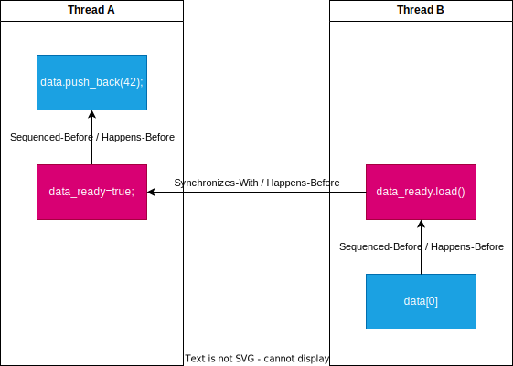

> One of the most important features of the C++ Standard is something most programmers won’t even notice. It’s not the new syntax features, nor is it the new library facilities, but the new multithreading-aware memory model. Without the memory model to define exactly how the fundamental building blocks work, none of the facilities I’ve covered could be relied on to work. There’s a reason that most programmers won’t notice: if you use mutexes to protect your data and condition variables, futures, latches, or barriers to signal events, the details of why they work aren’t important. It’s only when you start trying to get “close to the machine” that the precise details of the memory model matter. [^1]

在C++11标准中提出了多线程感知内存模型，它的出现使得提供各种多线程的基础设施成为可能。当你想要了解更深入地了解计算机底层时，理解内存模型的细节至关重要。

::: tip
*此处的内存模型指是指【多线程感知模型】，而不是C++对象内存布局等其他模型*
:::

## 现代架构优化

随着CPU单核性能提升愈发困难，难以通过垂直扩展来实现性能巨大飞跃。CPU架构逐渐向横向扩展演化，变成了如今的多核CPU架构。多核CPU架构也对程序设计带来了新的挑战，通过并发程序设计来提高运行效率显得尤为重要。

```
Latency Comparison Numbers (~2012)
----------------------------------
L1 cache reference                           0.5 ns
Branch mispredict                            5   ns
L2 cache reference                           7   ns                      14x L1 cache
Mutex lock/unlock                           25   ns
Main memory reference                      100   ns                      20x L2 cache, 200x L1 cache
Compress 1K bytes with Zippy             3,000   ns        3 us
Send 1K bytes over 1 Gbps network       10,000   ns       10 us
Read 4K randomly from SSD*             150,000   ns      150 us          ~1GB/sec SSD
Read 1 MB sequentially from memory     250,000   ns      250 us
Round trip within same datacenter      500,000   ns      500 us
Read 1 MB sequentially from SSD*     1,000,000   ns    1,000 us    1 ms  ~1GB/sec SSD, 4X memory
Disk seek                           10,000,000   ns   10,000 us   10 ms  20x datacenter roundtrip
Read 1 MB sequentially from disk    20,000,000   ns   20,000 us   20 ms  80x memory, 20X SSD
Send packet CA->Netherlands->CA    150,000,000   ns  150,000 us  150 ms

Notes
-----
1 ns = 10^-9 seconds
1 us = 10^-6 seconds = 1,000 ns
1 ms = 10^-3 seconds = 1,000 us = 1,000,000 ns

Credit
------
By Jeff Dean:               http://research.google.com/people/jeff/
Originally by Peter Norvig: http://norvig.com/21-days.html#answers

Contributions
-------------
'Humanized' comparison:  https://gist.github.com/hellerbarde/2843375
Visual comparison chart: http://i.imgur.com/k0t1e.png
```

这是[Jeff Dean](https://en.wikipedia.org/wiki/Jeff_Dean)在Google的某次Engineering All-Hands Meeting中分享的一些[时间数据](http://highscalability.com/numbers-everyone-should-know)。
从图中可以看到，读写RAM是一个非常耗时的操作。
为了缓解RAM与CPU之间巨大的速度差异，现代CPU架构引入了多级Cache架构。


这是Intel 13900K的Die Shot，在CPU与RAM之间有Store Buffer，L1 Cache、L2 Cache、L3 Cache。每个P Core拥有自己独占的L1、L2 Cache，而E Core则四个共享一份L2 Cache。所有的核心共享L3 Cache。

为了提高运行效率，硬件&软件工程师们做了许多优化。  
【硬件层面】：乱序执行，缓存一致性协议（Cache MESI Protocol）、Cache Ping-pong、Cache Miss  
【软件层面】：编译器会分析Code，找出更有效率的执行方案。

无论是CPU硬件优化还是编译器的软件优化，它们都遵循了一个同样的原则 —— AS-IF原则。

### AS-IF原则

> Allows any and all code transformations that do not change the observable behavior of the program.

“允许进行任何不改变程序可观察行为的代码转换”，这是对[AS-IF原则](https://en.cppreference.com/w/cpp/language/as_if)的简单概括。

什么是程序可观察行为？通俗来讲，就是代码的执行结果。在单线程环境下，只要代码经过转换后执行结果不变，即满足AS-IF优化原则。

对于下面的代码，我们可以很容易可以得出一个结论，无论代码在经过转换后是`S1 -> S2 -> S3`还是`S2 -> S1 -> S3`，`S3`的结果都不变。（`c == 2`恒成立）

```c++
int a = 0;
int b = 0;
int c = 0;

++a; // S1
++b; // S2

c = a + b; // S3
```

::: warning
“不改变程序可观察行为”仅限于单线程环境。在多线程环境下，CPU&编译器不保证不改变程序可观察行为。
:::

## 现代C++内存模型

内存模型并不是限制多线程之间的执行顺序，而是单线程内的指令执行对于其他线程的影响（修改内存所造成的影响将会如何传播给其他的线程）。

**为什么指令执行的影响又是修改内存的影响？**  
我的理解是，根据冯诺伊曼机的原理，所有的状态都保存在内存中，CPU只是一个计算部件，如果没有将计算结果（状态）保存下来，将不会对后续的计算有任何影响。
如果内存修改的状态没有按照预期的顺序传播给其他的线程，其他的线程的计算结果就必然是错误的。

为了便于理解C++内存模型，我将先从介绍一致性模型的基本概念入手。
对于下面介绍的概念，在[Cpp Reference](https://en.cppreference.com/w/cpp/atomic/memory_order)都有严格的形式化定义描述。

### 基本概念

#### Sequential Consistency

SC最开始是**Lamport**定义的，可以简述为两点：

* 对某个Processor而言，执行效果与代码顺序一致
* 对于所有Processor而言，所有的内存操作有一个单一的全局的Order

这里提到的全局Order，即是内存修改顺序的Order。SC可以保证所有的Processor可以看到相同的内存修改顺序。

#### Sequenced Before

Sequenced Before是所有先后关系中最好理解的一个，主要用于描述在同一线程中，求值间的先后关系：  
如果求值A**早于**求值B，则我们称为求值A **Sequenced Before** 求值B。

:::warning
在C++中，同一语句中也存在先后关系，例如逗号表达式，详细可见 [Evaluation Order](https://en.cppreference.com/w/cpp/language/eval_order)
:::

#### Synchronized With

Synchronizes-with是一个现代计算机科学中的概念，在C++11+，Java 5+这些语言标准中均出现了它的身影。
尽管每种语言定义下的Synchronizes-with的形式化定义不同，但是他们都有一个共同点：它描述的是两个操作之间的同步关系，尤其是不同线程之间的同步关系。
同时，根据Synchronizes-with又能在操作间推导出Happens-before关系。

C++定义下的Synchronized-With发生于原子操作的加载与存储之间。

> If an atomic store in thread A is a release operation, an atomic load in thread B from the same variable is an acquire operation, and the load in thread B reads a value written by the store in thread A, then the store in thread A synchronizes-with the load in thread B.

例如下面的代码中的 `S1` 与 `S4` 之间就存在Synchronized-With关系。

```c++
#include <vector>
#include <atomic>
#include <iostream>
std::vector<int> data;
std::atomic<bool> data_ready(false);

void reader_thread()
{
    while(!data_ready.load())                   // S1
    {
    std::this_thread::sleep(std::chrono::milliseconds(1));
    std::cout<<"The answer="<<data[0]<<"\n";    // S2
    }
}

void writer_thread()
{
    data.push_back(42);                         // S3
    data_ready=true;                            // S4
}
```

#### Happens Before

Happens Before可以分为两种情况：

* 【单线程下的Happens Before】：操作`A` Sequenced Before 操作`B`，则操作`A` Happens Before 操作`B`，且 `A` Strongly Happens Before `B`。
* 【多线程间的Happens Before】：如果线程`X`中的操作`A` Synchronizes With 线程`Y`中的操作`B`，则操作`A` Happens Before `B`

在单线程下，Happens Before理解起来很简单：如果操作`A` Sequenced Before 操作`B`，则操作`A` Happens Before 操作`B`，且 `A` Strongly Happens Before `B`。

这看起来很直观，有什么特别的呢？

特别之处就在于多线程模式下，Happens Before的关系将会变得复杂，因为它是一个偏序关系，存在传递性。

依旧是上面的Code Example，我们可以根据上述的定义画出一张表达Happens Before关系的图表。



当S1与S4之间存在 **Synchronizes With** 关系时，很容易得出 `data.push_back(42)` **Happens Before** `data[0]`。

### C++内存模型

在了解完基本概念之后，就可以来讲讲C++11标准中定义的内存模型了。在C++中，定义了4种C++ Memory Order：*SC*，*Acquire-Release*，*Consume-Release* 以及 *Relax*。

#### Sequential Consistency

SC是 `std::atomic<T>` 各种操作的默认Memory Order，它最严格，但是也最不容易出错。对于不了解Memory Order的开发者来说，这更符合他们的直觉。

对于使用SC Order的 `std::atomic<T>` ，可以保证任何Thread都能观察到同样的内存修改顺序。这在很多时候非常关键，例如下面的这段Example：

```c++
#include <thread>
#include <atomic>
#include <cassert>
 
std::atomic<bool> x = {false};
std::atomic<bool> y = {false};
std::atomic<int> z = {0};
 
void write_x()
{
    x.store(true, std::memory_order_seq_cst);
}
 
void write_y()
{
    y.store(true, std::memory_order_seq_cst);
}
 
void read_x_then_y()
{
    while (!x.load(std::memory_order_seq_cst));
    if (y.load(std::memory_order_seq_cst)) { ++z; }
}
 
void read_y_then_x()
{
    while (!y.load(std::memory_order_seq_cst));
    if (x.load(std::memory_order_seq_cst)) { ++z; }
}
 
int main()
{
    std::thread a(write_x);
    std::thread b(write_y);
    std::thread c(read_x_then_y);
    std::thread d(read_y_then_x);
    a.join(); b.join(); c.join(); d.join();
    assert(z.load() != 0);  // The assertation is always true
}
```

根据先前介绍的SC概念，`write_x()` & `write_y()` ~一定存在一个全局唯一~的Order。即 `read_x_then_y()` & `read_y_then_x()` 中一定至少有一个会执行到 `++z` 。因此 `assert(z.load() != 0)` 总是为 `true` 。

::: warning
如果将Memory Order修改成更加宽松的Order（Acquire-Release / Consume-Release / Relax），则这里的Assertation将可能失败。
:::

#### Acquire-Release

假设线程A & 线程B：

* 线程T1中有一个 *Atomic Store* 操作S携带标签 `memory_order_release` ，线程内 *Sequenced Before* 操作S的内存写入标记为S‘
* 线程T2中有一个 *Atomic Load* 操作L携带标签 `memory_order_acquire`，线程内**任意** *Sequenced Before* 操作L的内存读取标记为L’
一旦操作L完成，保证线程T2中L’可以观察到所有S’的改动。

这里有一段Sample Code以便于获得更加直观的理解：

```c++
#include <thread>
#include <atomic>
#include <cassert>
#include <string>
 
std::atomic<std::string*> ptr;
int data;
 
void producer()
{
    std::string* p  = new std::string("Hello");
    data = 42;
    ptr.store(p, std::memory_order_release);
}
 
void consumer()
{
    std::string* p2;
    while (!(p2 = ptr.load(std::memory_order_acquire)))
        ;
    assert(*p2 == "Hello"); // The assertation is always true
    assert(data == 42); // The assertation is always true
}
 
int main()
{
    std::thread t1(producer);
    std::thread t2(consumer);
    t1.join(); t2.join();
}
```

::: warning
同步仅建立在*释放*和*获得*同一原子对象的线程之间。其他线程可能看到与被同步线程的一者或两者相异的内存访问顺序。
:::

#### Relax

带标签 `memory_order_relaxed` 的原子操作不是同步操作；它们不会为并发的内存访问行为添加顺序约束。它们只保证原子性和修改顺序的一致性。

例如，默认 `x=0` & `y=0`

```c++
// Thread 1 ：
r1 = y.load(std::memory_order_relaxed); // A
x.store(r1, std::memory_order_relaxed); // B
// Thread 2 ：
r2 = x.load(std::memory_order_relaxed); // C 
y.store(42, std::memory_order_relaxed); // D
```

结果可能会为 `r1 == 42` && `r2 == 42` 。因为即使 *Thread 1* 中 A *先序于* B 且 *Thread 2* 中 C *先序于* D ，却没有约定去避免 D 中的对 `y` 的修改会在 A 之前 ， B 中的对 `x` 的修改会在 C 之前 。 D 的副效应为它对 `y` 修改可能可见于 A 的加载操作， B 的副效应为它对 `x` 修改可能可见于 C 的加载操作。

#### Consume-Release

> 释放消费顺序的规范正在修订中，而且暂时不鼓励使用 `memory_order_consume` 。（C++17起）

## 与 `volatile` 的关系

`volatile` 相比于 Memory Order有许多不同之处：

**相同点**

* 两者皆禁止编译期Reorder

**不同点**

* `volatile` 不是原子的
* `volatile` 不排序内存（非 volatile 内存访问可以自由地重排到 volatile 访问前后）

::: warning
Visual Studio的默认设置下，`volatile`读具有 *Release* 语义，而 `volatile` 写具有 *Acquire* 语义，因此可以将 `volatile` 对象用于线程间同步。而标准的 `volatile` 语义不可应用于多线程编程
:::

## 实际案例

### C++单例模式

## Reference

1. [Synchronizes-With-Relation](https://preshing.com/20130823/the-synchronizes-with-relation/)

[^1]：C++ Concurrency in Action 2nd
