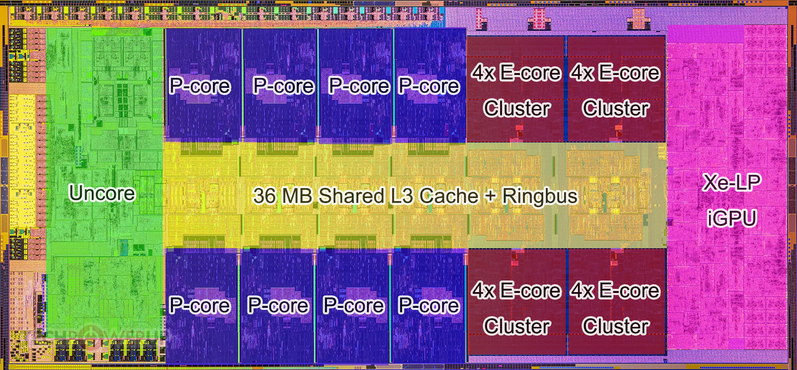

> One of the most important features of the C++ Standard is something most programmers won’t even notice. It’s not the new syntax features, nor is it the new library facilities, but the new multithreading-aware memory model. Without the memory model to define exactly how the fundamental building blocks work, none of the facilities I’ve covered could be relied on to work. There’s a reason that most programmers won’t notice: if you use mutexes to protect your data and condition variables, futures, latches, or barriers to signal events, the details of why they work aren’t important. It’s only when you start trying to get “close to the machine” that the precise details of the memory model matter. [^1]

在C++11标准中提出了多线程感知内存模型，它的出现使得提供各种多线程的基础设施成为可能。当你想要了解更深入地了解计算机底层时，理解内存模型的细节至关重要。

::: tip
*此处的内存模型指是指【多线程感知模型】，而不是C++对象内存布局等其他模型*
:::

## 现代架构优化

随着CPU单核性能提升愈发困难，难以通过垂直扩展来实现性能巨大飞跃。CPU架构逐渐向横向扩展演化，变成了如今的多核CPU架构。多核CPU架构也对程序设计带来了新的挑战，通过并发程序设计来提高运行效率显得尤为重要。

```
Latency Comparison Numbers (~2012)
----------------------------------
L1 cache reference                           0.5 ns
Branch mispredict                            5   ns
L2 cache reference                           7   ns                      14x L1 cache
Mutex lock/unlock                           25   ns
Main memory reference                      100   ns                      20x L2 cache, 200x L1 cache
Compress 1K bytes with Zippy             3,000   ns        3 us
Send 1K bytes over 1 Gbps network       10,000   ns       10 us
Read 4K randomly from SSD*             150,000   ns      150 us          ~1GB/sec SSD
Read 1 MB sequentially from memory     250,000   ns      250 us
Round trip within same datacenter      500,000   ns      500 us
Read 1 MB sequentially from SSD*     1,000,000   ns    1,000 us    1 ms  ~1GB/sec SSD, 4X memory
Disk seek                           10,000,000   ns   10,000 us   10 ms  20x datacenter roundtrip
Read 1 MB sequentially from disk    20,000,000   ns   20,000 us   20 ms  80x memory, 20X SSD
Send packet CA->Netherlands->CA    150,000,000   ns  150,000 us  150 ms

Notes
-----
1 ns = 10^-9 seconds
1 us = 10^-6 seconds = 1,000 ns
1 ms = 10^-3 seconds = 1,000 us = 1,000,000 ns

Credit
------
By Jeff Dean:               http://research.google.com/people/jeff/
Originally by Peter Norvig: http://norvig.com/21-days.html#answers

Contributions
-------------
'Humanized' comparison:  https://gist.github.com/hellerbarde/2843375
Visual comparison chart: http://i.imgur.com/k0t1e.png
```

这是[Jeaf Dean](https://en.wikipedia.org/wiki/Jeff_Dean)在Google的某次Engineering All-Hands Meeting中分享的一些[时间数据](http://highscalability.com/numbers-everyone-should-know)。
从图中可以看到，读写RAM是一个非常耗时的操作。
为了缓解RAM与CPU之间巨大的速度差异，现代CPU架构引入了多级Cache架构。




这是Intel 13900K的Die Shot，在CPU与RAM之间有Store Buffer，L1 Cache、L2 Cache、L3 Cache。每个P Core拥有自己独占的L1、L2 Cache，而E Core则四个共享一份L2 Cache。所有的核心共享L3 Cache。

为了提高运行效率，硬件&软件工程师们做了许多优化。  
【硬件层面】：缓存一致性协议（Cache MESI Protocol）、Cache Ping-pong、Cache Miss  
【软件层面】：编译器会分析Code，找出更有效率的执行方案。

无论是CPU硬件优化还是编译器的软件优化，它们都遵循了一个同样的原则 —— AS-IF原则。

### AS-IF原则

> Allows any and all code transformations that do not change the observable behavior of the program.

“允许进行任何不改变程序可观察行为的代码转换”，这是对[AS-IF原则](https://en.cppreference.com/w/cpp/language/as_if)的简单概括。

什么是程序可观察行为？

::: warning
“不改变程序可观察行为”仅限于单线程环境。在多线程环境下，CPU&编译器不保证不改变程序可观察行为。
:::

## 现代C++内存模型

[^1]: C++ Concurrency in Action 2nd
