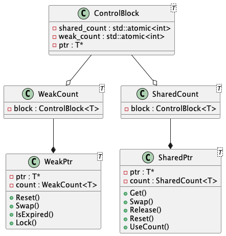

Smart Pointer 自从 C++ 11 被引入以来，被大量使用在生产环境中，但这不代表所有的 C++ 开发者 们都对它的底层原理足够了解，本文期望通过自行实现一个 Simple Smart Pointer 来更深入理解 C++ 11 标准中的 Smart Pointer。

## 核心原理

在讨论具体的实现细节之前，需要先了解什么是引用计数，以及如何通过引用计数来管理内存。

对于一个堆对象来说，当其他的对象持有指向该对象的指针时，就说明存在其他的对象正在使用该对象，此时这个堆对象自然不能被释放。而当没有其他的对象拥有指向该对象的指针时，隐含着一个信息：这个堆对象可以被释放了。想要实现这样的效果很简单，一个整数来统计有多少对象持有该对象的指针即可。这就是引用计数的本质。

用引用计数来实现资源自动释放，这听起来十分美好，但现实往往是不完美的，充满着各种 Corner Case。当出现环形依赖时，引用计数就无法正常工作了，这和多线程编程中的死锁问题非常类似。解决问题的思路便是将环打破，不再出现环形依赖。为此，这需要引入弱引用的概念，弱引用只有提升为强引用才会真正增加引用计数，如果提升为强引用失败，则说明该资源已经被释放了。

## C++ 实现

为了实现上述的效果，需要在对象中增加一个引用计数块，它维护对象的引用计数以及弱引用计数并在引用计数为0时释放资源。

实现 C++ 智能指针，会涉及到如下的技术点：

* Syntax
  * RAII (Resource Acquisition Is Initialization)
  * Rule of Three/Five/Zero
  * C++ Template/Meta Programming
* Concurrency Programming
  * C++ Memory Order
  * Lock-Free Programming

下面是一份我自己的智能指针实现，类图如下：



主要由 5 个部分组成：

* ControlBlock：维护引用计数&指针指向的内存区域
* WeakCount：弱引用计数，为了实现3/5/0法则而做的封装
* SharedCount：强引用计数，为了实现3/5/0法则而做的封装
* WeakPtr：WeakPtr实现
* SharedPtr：SharedPtr实现

### 资源释放时机

WeakPtr 与 SharedPtr 里包含2种资源：ControlBlock 以及 指针指向的内存，这两种都以指针的方式保存。

* 指针指向的内存：当 SharedCount 为 0 时清理
* ControlBlock：当 SharedCount & WeakCount 都为 0 时清理

当 WeakPtr 需要转换为 SharedPtr 时，需要判断 SharedCount 是否为 0 来确定指针指向的内存是否已经被释放。

释放资源的代码在 ControlBlock 中实现，主要是以下两个函数，使用了 `delete this` 来实现自我清理。

```c++
// fetch_sub() must be std::memory_order_acq_rel, because the atomic variable needs to
// synchronize-with itself
constexpr void DecreaseShared() noexcept {
  if (shared_count_.fetch_sub(1, std::memory_order_acq_rel) == 1) {
    ReleaseResource();
    if (weak_count_.load(std::memory_order::acquire) == 0) {
      delete this;
    }
  }
}

constexpr void ReleaseResource() {
  if (ptr_ != nullptr) {
    delete ptr_;
    ptr_ = nullptr;
  }
}
```

下面是完整的代码实现：

```c++

using Count = unsigned;

template <typename T>
class ControlBlock {
 public:
  ControlBlock() = default;

  explicit ControlBlock(T* ptr) : ptr_(ptr) {}

  // fetch_add() can be std::memory_order_relaxed, because the atomic variable no need to have
  // synchronize-with relationship
  constexpr void IncreaseShared() noexcept {
    shared_count_.fetch_add(1, std::memory_order_relaxed);
  }

  // fetch_sub() must be std::memory_order_acq_rel, because the atomic variable needs to
  // synchronize-with itself
  constexpr void DecreaseShared() noexcept {
    if (shared_count_.fetch_sub(1, std::memory_order_acq_rel) == 1) {
      ReleaseResource();
      if (weak_count_.load(std::memory_order::acquire) == 0) {
        delete this;
      }
    }
  }

  constexpr void IncreaseWeak() noexcept { weak_count_.fetch_add(1, std::memory_order::relaxed); }

  constexpr void DecreaseWeak() noexcept {
    if (weak_count_.fetch_sub(1, std::memory_order::acq_rel) == 1) {
      if (shared_count_.load(std::memory_order::acquire) == 0) {
        delete this;
      }
    }
  }

  constexpr bool IncreaseSharedByCAS() noexcept {
    Count count = SharedCount();

    // using CAS to increase the shared_count_ is necessary!
    //
    // If this function is implemented by shared_count_.fetch_add(), you need to call fetch_sub() to
    // make the reference count back after the shared_count_.fetch_add() returned 0 which indicates
    // that the raw data pointer has been released.
    // Other weak pointers may access the raw data pointer as unexpected if they observe the
    // shared_count_ between the effect of fetch_add() and fetch_sub().
    //
    // The following code example is buggy:
    //    if (shared_count_.fetch_add(1, std::memory_order::relaxed) == 0) {
    //      shared_count_.fetch_sub(1, std::memory_order::acq_rel);
    //      return false;
    //    }
    //    return true;

    do {
      if (count == 0) {
        return false;
      }
      // no need to build synchronize with relationship if CAS is failed
    } while (!shared_count_.compare_exchange_weak(count, count + 1, std::memory_order::acq_rel,
                                                  std::memory_order::relaxed));

    return true;
  }

  [[nodiscard]] constexpr Count SharedCount() const noexcept {
    return shared_count_.load(std::memory_order::relaxed);
  }

  [[nodiscard]] constexpr Count WeakCount() const noexcept {
    return weak_count_.load(std::memory_order::relaxed);
  }

 private:
  constexpr void ReleaseResource() {
    if (ptr_ != nullptr) {
      delete ptr_;
      ptr_ = nullptr;
    }
  }

  std::atomic<Count> shared_count_{1};
  std::atomic<Count> weak_count_{0};
  T* ptr_{nullptr};
};

template <typename T>
class SharedCount;
template <typename T>
class WeakCount;

template <typename T>
class WeakCount {
 public:
  constexpr explicit WeakCount(nullptr_t) noexcept : block_(nullptr) {}

  constexpr explicit WeakCount(const SharedCount<T>& shared_count) noexcept;

  constexpr WeakCount(const WeakCount& weak_count) : block_(weak_count.block_) { TryIncrease(); }

  constexpr WeakCount(WeakCount&& weak_count) noexcept : WeakCount() { Swap(weak_count); };

  ~WeakCount() noexcept { TryDecrease(); }

  constexpr WeakCount& operator=(const WeakCount& rhs) noexcept {
    if (this != &rhs) {
      TryDecrease();
      block_ = rhs.block_;
      TryIncrease();
    }
    return *this;
  }

  constexpr WeakCount& operator=(WeakCount&& rhs) noexcept {
    if (this != &rhs) {
      WeakCount empty;
      empty.Swap(rhs);
      empty.Swap(*this);
    }
    return *this;
  }

  constexpr void Swap(WeakCount& weak_count) { std::swap(block_, weak_count.block_); }

  constexpr Count GetSharedCount() const noexcept { return block_->SharedCount(); }

 private:
  constexpr WeakCount() = default;

  constexpr void TryIncrease() {
    if (block_) {
      block_->IncreaseWeak();
    }
  }

  constexpr void TryDecrease() {
    if (block_) {
      block_->DecreaseWeak();
    }
  }

  friend class SharedCount<T>;

  ControlBlock<T>* block_{nullptr};
};

template <typename T>
class SharedCount {
 public:
  SharedCount() = default;

  explicit SharedCount(nullptr_t) : SharedCount(){};

  explicit SharedCount(T* ptr) : block_(ptr ? new ControlBlock<T>(ptr) : nullptr) {}

  constexpr explicit SharedCount(const WeakCount<T>& weak_count) noexcept;

  constexpr SharedCount(const SharedCount& shared_count) noexcept : block_(shared_count.block_) {
    TryIncrease();
  }

  constexpr SharedCount(SharedCount&& shared_count) noexcept : SharedCount() { Swap(shared_count); }

  constexpr ~SharedCount() noexcept { TryDecrease(); }

  constexpr SharedCount& operator=(const SharedCount& rhs) noexcept {
    if (this != &rhs) {
      TryDecrease();
      block_ = rhs.block_;
      TryIncrease();
    }
    return *this;
  }

  constexpr SharedCount& operator=(SharedCount&& rhs) noexcept {
    if (this != &rhs) {
      SharedCount empty;
      empty.Swap(rhs);
      empty.Swap(*this);
    }
    return *this;
  }

  constexpr void Swap(SharedCount& shared_count) { std::swap(block_, shared_count.block_); }

  [[nodiscard]] Count GetSharedCount() const noexcept { return block_ ? block_->SharedCount() : 0; }

 private:
  constexpr void TryIncrease() {
    if (block_) {
      block_->IncreaseShared();
    }
  }

  constexpr void TryDecrease() {
    if (block_) {
      block_->DecreaseShared();
    }
  }

  constexpr bool TryIncreaseByCASE() { return block_ && block_->IncreaseSharedByCAS(); }

  friend class WeakCount<T>;

  ControlBlock<T>* block_{nullptr};
};

template <typename T>
constexpr SharedCount<T>::SharedCount(const Facilities::WeakCount<T>& weak_count) noexcept
    : block_(weak_count.block_) {
  if (!TryIncreaseByCASE()) {
    block_ = nullptr;
  }
}

template <typename T>
constexpr WeakCount<T>::WeakCount(const SharedCount<T>& shared_count) noexcept
    : block_(shared_count.block_) {
  TryIncrease();
}

template <typename T>
class SharedPtr;

template <typename T>
class WeakPtr;

template <typename T>
class SharedPtr {
 public:
  constexpr SharedPtr() = default;

  constexpr SharedPtr(nullptr_t) noexcept : SharedPtr(){};

  constexpr explicit SharedPtr(T* ptr) noexcept : ptr_(ptr), count_(ptr){};

  constexpr bool operator==(const SharedPtr& rhs) const noexcept { return ptr_ == rhs.ptr_; };

  constexpr auto operator<=>(const SharedPtr& rhs) const noexcept { return ptr_ <=> rhs.ptr_; };

  constexpr explicit operator bool() const noexcept { return ptr_ != nullptr; }

  constexpr T& operator*() const noexcept { return *ptr_; }

  constexpr T* operator->() const noexcept { return ptr_; }

  constexpr T* Get() const noexcept { return ptr_; }

  constexpr void Swap(SharedPtr& shared_ptr) noexcept {
    std::swap(ptr_, shared_ptr.ptr_);
    count_.Swap(shared_ptr.count_);
  };

  constexpr void Reset(T* ptr = nullptr) {
    ptr_ = ptr;
    count_ = SharedCount<T>(ptr);
  }

  constexpr void Release() {
    ptr_ = nullptr;
    count_ = SharedCount<T>{};
  }

  [[nodiscard]] constexpr Count UseCount() const noexcept { return count_.GetSharedCount(); }

 protected:
  constexpr SharedPtr(T* ptr, const WeakCount<T>& weak_count) noexcept
      : ptr_(ptr), count_(weak_count) {
    ptr_ = count_.GetSharedCount() == 0 ? nullptr : ptr;
  }

 private:
  friend class WeakPtr<T>;

  T* ptr_{nullptr};
  SharedCount<T> count_;
};

template <typename T>
class WeakPtr {
 public:
  constexpr WeakPtr(const SharedPtr<T>& shared_ptr) noexcept
      : ptr_(shared_ptr.ptr_), weak_count_(shared_ptr.count_) {}

  void Reset() {
    ptr_ = nullptr;
    weak_count_ = WeakCount<T>{nullptr};
  }

  void Swap(WeakPtr& weak_ptr) {
    std::swap(ptr_, weak_ptr.ptr_);
    weak_count_.Swap(weak_ptr.weak_count_);
  }

  [[nodiscard]] bool IsExpired() const noexcept { return weak_count_.GetSharedCount() == 0; }

  SharedPtr<T> Lock() { return SharedPtr<T>{ptr_, weak_count_}; }

 private:
  T* ptr_;
  WeakCount<T> weak_count_;
};
```

## FAQ

Q：为什么在典型的 `std::shared_ptr<T>` 实现中存在两个可能不同的 Raw Pointer？  
A：[c++ - Why are two raw pointers to the managed object needed in std::shared_ptr implementation? - Stack Overflow](https://stackoverflow.com/questions/34046070/why-are-two-raw-pointers-to-the-managed-object-needed-in-stdshared-ptr-impleme)

To be continued…
