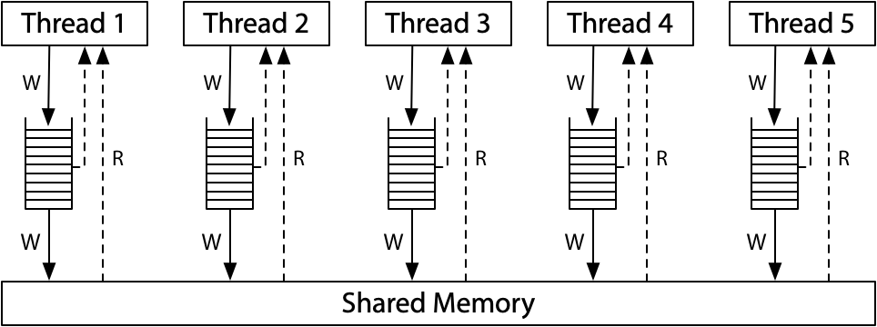

回想起第一次接触到内存模型还是在一道常见的面试题中：请实现一个正确的 C++ 单例模式。

在 C++11 中，已经有了更加方便的方法来实现单例模式，但这是一个很好的切入点，能够帮助我了解如何在多线程并发下写出高性能、正确的代码。

《C++ Concurrency In Action 2nd》的第五章以及 [Hardware Memory Models (Memory Models, Part 1)](https://research.swtch.com/hwmm) 是很好的文章，在整理了其中的知识点后写成了这篇文章。

## 内存模型的历史

在计算机硬件以及软件发展得越来越复杂后，硬件的行为变得不再直观。这大大提高了在这些硬件上开发的心智负担，工程师们迫切需要一个契约来约束硬件&软件的行为，这个契约就是内存一致性模型。

内存模型分为两个层面：硬件和软件。软件上的内存模型往往由编程语言定义，称为 Programming Language Memory Model，它屏蔽了各种硬件内存模型的差异，这有助于 Programmer 写出更加通用的代码。而这一切都依赖硬件上提供的一致性保证，硬件上的内存一致性模型被称为 Hardware Memory Model。

我将先从 Hardware Memory Model 开始介绍，并从它入手介绍 Programming Language Memory Model，这有助于你更好地理解 C++ Memory Model。

### Hardware Memory Model

#### Single-Core

从第一台通用电子计算机 ENIAC 发明以来，CPU的运算性能发生了翻天覆地般的变化。为了提高 CPU 的运算效率，硬件工程师们设计出了多级存储结构：寄存器、Cache、RAM 和外存。

在单核时代，要想让你的程序运行更加迅速，作为一个 Programmer 最好的办法就是什么也不做，因为不断更新换代的硬件&编译器在不停地突破性能的上限，你需要做的只是升级硬件与编译器版本。而硬件工程师与编译器工程师们优化的思路很简单：只要这个优化不会影响最后的运行结果，那么这个优化就是有效的，他们给这个优化原则起了一个名字——AS-IF原则。

> *valid optimizations do not change the behavior of valid programs.* (by  Russ Cox, Go Project Leader)  

下面的示例代码是一个很好的例子：无论代码的执行顺序是 `S1 -> S2 -> S3` 还是 `S2 -> S1 -> S3` ， `S3` 的结果都不变。（ `c == 2` 恒成立）

```c++
int a = 0;
int b = 0;
int c = 0;

++a; // S1
++b; // S2

c = a + b; // S3
```

#### Multi-Core

在这个领域，本就不存在什么银弹。硬件工程师们发现单核心的性能提升因为物理规律等限制出现了瓶颈，但与此同时，他们也发现了通过简单的堆砌 CPU 核数就可以继续提升性能，这些核心通过操作系统抽象的 Thread 来提供并行计算的能力。

当纵向扩展出现阻力的时候，研究横向扩展似乎是一个不错的思路，但这会导致一个非常致命的问题： **在单核时代做的许多优化工作因为并行计算的引入对软件工程师可见了。**

这不禁让人怀疑，究竟之前的优化是无效的，还是程序本身是错误的？

为了方便理解，这里举一个简单的例子：

```c++
// Thread 1           // Thread 2
x = 1;                while(done == 0) { /* loop */ }
done = 1;             print(x);
```

如果这两个线程在一个多处理器系统下运行，这个程序可能打印出 0 吗？
答案不是固定的，这取决于硬件 & 编译器。如果严格按照代码一行一行执行，在 X86 多核处理器下总是会打印 1，而在 ARM 或 POWER 的多核处理器下则有可能打印出 0。值得注意的是，常见的编译优化可能导致打印出 0 或无限循环。

“变化”往往会带来复杂度，软件工程师们需要明确的答案得知它的程序能否在其他的硬件上正确地运行；硬件工程师以及编译器开发者需要明确的答案来确定对于一份新的代码，硬件以及编译后的代码所有可能出现的行为。

给定一个固定的输入，则通过计算机的计算可以得到一个固定的输出，广义上讲，计算机的使用者关心的是最后的输出，对于内部如何计算，并不是他们关心的重点。输出往往表示的是一种状态，而状态需要保存在存储器中，也就是内存（RAM）。
因此这里涉及到的主要是内存在被修改后的可见性&一致性问题，这个约束被称为**”内存一致性模型“**，也可简称为**”内存模型“**。

#### 常见的硬件内存模型

内存一致性关注对内存的读写操作访问，由此可得到4种不同的指令组合，依次为Store-Load、Store-Store、Load-Store、Load-Load，通过允许调整这些指令组合执行的顺序，可以获得不同的内存一致性模型。目前有多种内存一致性模型，从上到下模型的限制由强到弱，依次为：

##### 顺序一致性（Sequential Consistency，简写SC）模型

其他的 CPU 的视角中看到的顺序和指令执行的顺序保持一致，是一种强一致的内存模型。

**为什么这里说的是指令的执行顺序而不是代码的执行顺序？**

因为代码的执行顺序与指令的执行顺序因为编译器的存在可能并不一致，对于硬件来说，关注的是编译器产生的指令顺序，而不是代码的执行顺序。


```
Litmus Test: Message Passing
Can this program see r1 = 1, r2 = 0?
// Thread 1           // Thread 2
x = 1                 r1 = y
y = 1                 r2 = x
```

假定所有的变量初始值为 0，所有的线程都运行在特定的 CPU 核心，并且没有编译器优化来打乱代码中的顺序。`rN` 是一个 *Thread Local* 变量，在程序执行结束的时候， `r1` 以及 `r2` 有可能为上面的值吗？

我们把这种执行结果相关的示例代码称为 *Litmus Test*，它只有两个结果，有可能或不可能。对于两个模型的 *Litmus Test* 的结果不相同，那显然这两个模型拥有不同的内存模型。

对于 SC 模型，将其执行顺序进行排列组合后，会发现上面的 *Litmus Test* 的结果是不可能出现的。

**特点**

* 不允许 Store-Load、 Store-Store、Load-Store、Load-Load乱序

##### 完全存储定序（Total Store Order，简写TSO）模型

**Store Buffer**
写入数据相比于读取是一个更加耗时的操作，所以对于像 X86 架构的 CPU，硬件工程师们在 CPU 与 Cache 之间还增加了一个 *Store Buffer*，CPU 并不直接将数据写入到 Cache，而是将数据提交到 *Store Buffer* 中，由 *Store Buffer* 异步地按照 *FIFO* 的原则将数据依次刷入到 Cache 中。



这导致 Load 指令不必等待前面的 Store 指令真正完成之后才执行，在单核处理器系统中，这样的行为不会导致乱序，因为 Load 指令会优先查询 *Store Buffer* 中的内容。但是对于多处理器系统来说，则会出现一些意料之外的情况。

```
Litmus Test: Message Passing 
Can this program see r1 = 1, r2 = 0?
// Thread 1           // Thread 2
x = 1                 r1 = y
y = 1                 r2 = x
On sequentially consistent hardware: no.
On x86 (or other TSO): no.
```

在 TSO 模型下，这个 *Litmus Test* 不可能发生，因为 *Store Buffer* 拥有 *FIFO (First In First Out)* 的特点，当 `y = 1` 的修改被提交至内存时，`x = 1` 一定已经被提交至内存，可以看到，SC 以及 TSO 模型来面对这种情况下的行为是一致的，但它们可以通过下面的 *Litmus Test* 来进行区分：

```
Litmus Test: Write Queue (also called Store Buffer) 
Can this program see r1 = 0, r2 = 0?
// Thread 1           // Thread 2
x = 1                 y = 1
r1 = y                r2 = x
On sequentially consistent hardware: no.
On x86 (or other TSO): yes!
```

*Thread 1* 与 *Thread 2* 都有可能因为改动还存在另一个线程的 *Store Buffer* 中而不能从内存中读取到最新的值，因此两个读操作都有可能为 0。

为了让这段代码能够符合预期，不是 SC 模型的 CPU 往往会提供一些显式的指令来达到这个效果，这些指令称之为 *Memory Barrier（内存屏障）*。

最后一个例子可以说明为什么这个模型被称之为 TSO 模型

```
Litmus Test: Independent Reads of Independent Writes (IRIW)
Can this program see r1 = 1, r2 = 0, r3 = 1, r4 = 0?
(Can Threads 3 and 4 see x and y change in different orders?)
// Thread 1    // Thread 2    // Thread 3    // Thread 4
x = 1          y = 1          r1 = x         r3 = y
                              r2 = y         r4 = x
On sequentially consistent hardware: no.
On x86 (or other TSO): no.
```

在 TSO 模型中，对于内存的修改一定存在一个全局的顺序，所有的线程都能看到相同的修改顺序： Thread 3 与 Thread 4 只能看到 `x` 先 `y` 后，或者 `y` 先 `x` 后。

**特点**

* 允许 Store-Load 乱序
* 不允许 Store-Store、Load-Store、Load-Load乱序
* 使用该内存模型的代表：X86

##### 部分存储定序（Part Store Order，简写PSO）模型
**特点**
允许 Store-Store、Store-Load 乱序
不允许 Load-Store、Load-Load乱序

##### 宽松存储（Relax Memory Order，简写RMO）模型
RMO 模型是一种比 X86-TSO 模型更弱的一致性模型，这种模型的典型的代表有：ARM & POWER。虽然在在实现层面拥有不小的差异，但是从他们提供的内存一致性保证来说，基本上是一致的。

不同的核心从自己完整的内存拷贝中读取和写入，写入独立传播到其他处理器，并且允许重排序。


```
Litmus Test: Message Passing
Can this program see r1 = 1, r2 = 0?
// Thread 1           // Thread 2
x = 1                 r1 = y
y = 1                 r2 = x
On sequentially consistent hardware: no.
On x86 (or other TSO): no.
On ARM/POWER: yes!
```

上面的这个 *Litmus Test* 很好的展示了 RMO 模型与 TSO 模型的差异：变量之间的写入不再拥有一个全局的Order。

```
Litmus Test: Store Buffering
Can this program see r1 = 0, r2 = 0?
// Thread 1           // Thread 2
x = 1                 y = 1
r1 = y                r2 = x
On sequentially consistent hardware: no.
On x86 (or other TSO): yes!
On ARM/POWER: yes!
```

虽然在 RMO 模型中不存在 *Store Buffer* ，但是由于写入内存的改动会被延迟传播到读取之后，上面的 *Litmus Test* 仍然有可能发生。

```
Litmus Test: Load Buffering 
Can this program see r1 = 1, r2 = 1? 
(Can each thread's read happen after the other thread's write?)
// Thread 1    // Thread 2
r1 = x         r2 = y
y = 1          x = 1
On sequentially consistent hardware: no.
On x86 (or other TSO): no.
On ARM/POWER: yes!
```

更神奇的是，RMO 模型还允许 Load 指令延迟到 Store 之后执行，因此上面的 *Litmus Test*，在 ARM 或 PWOER 处理器上是可能发生的。

```
Litmus Test: Coherence
Can this program see r1 = 1, r2 = 2, r3 = 2, r4 = 1?
(Can Thread 3 see x = 1 before x = 2 while Thread 4 sees the reverse?)
// Thread 1    // Thread 2    // Thread 3    // Thread 4
x = 1          x = 2          r1 = x         r3 = x
                              r2 = x         r4 = x
On sequentially consistent hardware: no.
On x86 (or other TSO): no.
On ARM/POWER: no.
```

RMO 模型对于内存一致性的约束很少，但不是完全没有约束。对于相同的内存地址，PMO 模型可以保证所有的处理器能够看到相同的修改顺序。这种属性被称为 *Coherence*

**特点**

* 允许 Store-Load、 Store-Store、Load-Store、Load-Load乱序
* 使用该内存模型的代表：ARM、POWER

#### Data Race Free (DRF)

在讨论 Programming Language Memory Model 之前，需要先聊聊 Data Race Free (DRF) 对于多线程并发编程的意义。

分布式一致性算法 Paxos 论文的作者 Leslie Lamport 在他 1979 年的论文 [How to Make a Multiprocessor Computer That Correctly Executes Multiprocess Programs - Microsoft Research](https://www.microsoft.com/en-us/research/publication/make-multiprocessor-computer-correctly-executes-multiprocess-programs/) 中提出了今后在内存模型领域深入人心的概念，*Sequential Consistency*。这篇论文告诉我们在多处理器系统系统下，底层的系统需要满足 *Sequential Consistency* 要求，才能保证程序的正确性，即计算的结果与 Programmer 的预期是一样的。

想要在硬件层面实现 *Sequential Consistency* 模型的代价是非常高昂的，这会导致许多的优化无效。如何在保证程序正确性的前提下尽可能地优化硬件的性能，是一个难题。业界希望能够设计出一种模型，他能够保证 Programmer 在符合这个模型的要求下写出运行正确的程序，但同时也给底层硬件留出了足够的优化空间。

对此，Sarita Adve & Mark Hill 在 1990 年的论文 [Weak Ordering - A New Definition](http://citeseerx.ist.psu.edu/viewdoc/summary?doi=10.1.1.42.5567) 中定义了 *Weakly Ordered*：

> Let a synchronization model be a set of constraints on memory accesses that specify how and when synchronization needs to be done.  
>   
> Hardware is weakly ordered with respect to a synchronization model if and only if it appears sequentially consistent to all software that obey the synchronization model.  

硬件只需要在 Programmer “在意”的地方保证 *Sequential Consistency*，对于那些”不在意“的地方，硬件可以在更弱的内存模型下运行。这个“在意“就是 *Synchronization* 同步。

只要程序进行了正确&足够的同步，这种内存模型就能保证和在 *Sequential Consistency* 的硬件下运行的结果一样。

Adve & Hill 给出了一个同步模型，叫做 *Data Race Free (DRF)*。在这个模型下，除了内存写入&读取外，还有一个操作：*Synchronization*。内存的读写操作可以在同步操作间进行任意重排序，但是不能跨过这些同步操作，就像一个屏障一样。如果对于同一个内存地址不同线程要么同时读，要么被同步操作分隔开，那么就称为它是满足 *DRF* 模型的。一个系统在满足了 *DRF* 后能够保证 *Sequential Consistency* 也被缩写成 *DRF-SC*。

本质上，*DRF-SC* 要求程序在整体的内存顺序上可以不是一个全序关系，但是对于会影响到程序执行结果的内存顺序，需要通过建立偏序关系来保证正确性。

### Programming Language Memory Model

```
Can this program print 0 or run in a infinity loop?
// Thread 1           // Thread 2
x = 1;                while(done == 0) { /* loop */ }
done = 1;             print(x);
```

这段代码在前面的章节中出现过很多次，我们讨论在讨论硬件内存模型的时候是建立在没有编译器优化的前提下。还是以这段代码为例，看看编译器在正常工作时都会发生什么。

尽管不同的编程语言存在不小的差异，但是在某些问题上却可以达成一样的结论：上面的代码在 C、C++、Go、Java、JavaScript、Rust 以及 Swift 中都有可能发生，原因主要有两点：

1. 如果 `x` & `done` 是普通变量，程序也许永远不会停止，因为将普通变量保存在寄存器中是一种常见的编译器优化手段。Thread 2 如果一直检查寄存器而不是内存中 `done` 的值，就有可能会因为 `done` 总是为 0 而无限循环。
2. 即使程序不是无限循环，编译器还会对代码进行重排序。Thread 1 中的 `done = 1;` 也许会在 `x = 1;` 前执行；Thread 2 中的 `print(x)` 也许会在 `while(done == 0) { /* loop */ }` 前执行。

现代语言中普遍提供了 *atomic variables* 或者 *atomic operations*，它们有许多效果：

1. 编译器保证 `x=1` 早于 `done=1` 在其他线程可见
2. Thread 2 中每次 `while(done == 0)` 总是会从内存中读取最新的值
3. Thread 2 中读取 `x` 的值一定晚于 `while(done == 0) {}` 执行
4. 保证禁用任何会导致影响上面效果的硬件优化

#### Java Memory Model

Java 是第一个尝试保证多线程开发下程序行为的主流编程语言，第一版  [Java Language Specification (1996)](http://titanium.cs.berkeley.edu/doc/java-langspec-1.0.pdf)  发布于 1996，但它存在一些瑕疵。因此，2004 年的 Java 5.0 采用了全新设计的内存模型，这个模型在 2005 年由 Jeremy Manson, Bill Pugh 和 Sarita Adve 联合发表了论文 [Java Memory Model](http://rsim.cs.uiuc.edu/Pubs/popl05.pdf) 

新模型遵循了前面提到了 *DRF-SC* 方法，保证 *Data Race Free* 的 Java 程序会以 *Sequential Consistency* 的方式来执行。

值得一提的是，Java 的内存模型还试图在 Programmer 不满足 *Data Race Free* 的情况下对程序的行为进行一定的约束。

#### C++ Memory Model

受到 Java Memory Model 的启发，许多人开始尝试为 C++ 设计语言内存模型。并在 C++ 11 标准中被正式采用。相比 Java Memory Model，C++ 的 Memory Model 存在两个重要的差异：

1. 对于没有遵循 *Data Race Free* 的程序，C++ 标准不会对它的行为做出任何保证（未定义行为，UB）
2. C++ 提供了 3 种不同的原子同步：强同步（*Sequential-Consistency*）、弱同步（*Acquire-Release*, *Consume-Release*）以及无同步（*Relax*）

备注：C++ 11 的内存模型设计也在 C、Rust、Swift 中被使用

- - - -

## 参考资料

[std::memory_order - cppreference.com](https://en.cppreference.com/w/cpp/atomic/memory_order)
[The Synchronizes-With Relation](https://preshing.com/20130823/the-synchronizes-with-relation/)
[C++ 内存模型](https://paul.pub/cpp-memory-model/)
[Memory Models by Russ Cox](https://research.swtch.com/mm)
